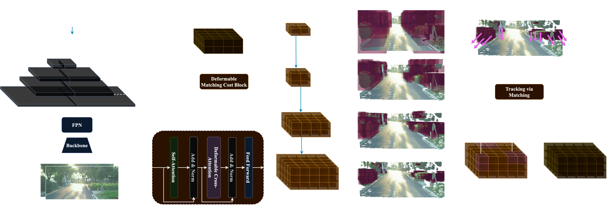

# ODTFormer: Efficient Obstacle Detection and Tracking with Stereo Cameras Based on Transformer

Official PyTorch codebase for our IROS 2024 Paper! A transformer-based architecture enables efficient detection and 
tracking of voxel occupancies from temporal sequences of stereo pairs.

Note: the `main` branch is for our occupancy-only implementation, to see the entire architecture with tracking module,
please check out the `voxel-flow` branch.

Tianye Ding*, Hongyu Li*, Huaizu Jiang

Northeastern University, Brown University

[\[Paper\]](https://arxiv.org/abs/2403.14626)
[\[Video\]](https://youtu.be/zyVpXrjTBRI?si=OSZiEf9RoZAVgwMd)
[\[Project Page\]](https://jerrygcding.github.io/odtformer/)



## Installation
### Requirements
The code is tested on:
* CentOS Linux 7
* Python 3.10
* PyTorch 2.1.0
* Torchvision 0.16.0
* CUDA 11.8
* GCC 10.1.0

### Create Conda Environment

```bash
conda env create -f environment.yaml
conda activate odtformer
```

## Data Preparation
### DrivingStereo
Download and extract DrivingStereo training, testing images with depth data, and calibration parameters from the 
[following link](https://drivingstereo-dataset.github.io/).

We organize the dataset by the following file tree
```
.
├── calib
│       └── half-image-calib
│               └── *.txt
├── test-calib
│       └── half-image-calib
│               └── *.txt
├── test-depth-map
│       └── depth-map-half-size
│               ├── 2018-07-11-14-48-52_2018-07-11-14-50-08-769.png
│               └── ...
├── test-gt                                                             # precomputed testing ground-truth labels (generated)
│       └── gt-half-size
│               ├── 2018-07-11-14-48-52_2018-07-11-14-50-08-769.pt
│               └── ...
├── test-left-image
│       └── left-image-half-size
│               ├── 2018-07-11-14-48-52_2018-07-11-14-50-08-769.jpg
│               └── ...
├── test-right-image
│       └── right-image-half-size
│               ├── 2018-07-11-14-48-52_2018-07-11-14-50-08-769.jpg
│               └── ...
├── train-depth-map
│       ├── 2018-07-09-16-11-56
│       │       └── *.png
│       └── ...
├── train-gt                                                            # precomputed training ground-truth labels (generated)
│       ├── 2018-07-09-16-11-56
│       │       └── *.pt
│       └── ...
├── train-left-image
│       ├── 2018-07-09-16-11-56
│       │       └── *.jpg
│       └── ...
└── train-right-image
        ├── 2018-07-09-16-11-56
        │       └── *.jpg
        └── ...
```
Note: only `half-size` image data are used for training and testing.

Although our dataset implementations support computing ground-truth voxel occupancy labels during runtime, empirical 
experiments show that such practice would consume excessive computation resources and severely impact running 
efficiency.
Thus, we provide an implementation for precomputing and storing ground-truth voxel occupancy labels compatible with 
Slurm array jobs within [ds_gt_gen.py](ds_gt_gen.py).

To check the validity of the dataset index filepaths, update the directory and file paths accordingly and run 
[filenames/filename_validate.py](filenames/filename_validate.py) as below:
```bash
python filenames/filename_validate.py
```

## Code Structure
**Config files:**
All experiment parameters are specified in config files (as opposed to command-line arguments). See the 
[config/](config/) directory for example config files. 

Note: before launching an experiment, you must update the paths in the config file to point to your own directories, 
especially within following directories and files [config/dataloader/dataset/](config/dataloader/dataset/), 
[config/trainer/](config/trainer/) and [config/eval_model.yaml](config/eval_model.yaml), indicating where to save the 
logs and checkpoints and where to find the training data.

Temporary config changes are also supported through command-line arguments. See section 
[Launching ODTFormer Experiments](#launching-odtformer-experiments) for examples or check out the official documentation 
of [hydra](https://hydra.cc/docs/intro/).
```
.
├── checkpoints                     # directory for storing model checkpoints
├── config                          # directory for config files
│       ├── dataloader              #   dataloader config
│       │       └── dataset         #       dataset config
│       ├── dist                    #   distributed training config
│       ├── model                   #   model config
│       │       ├── backbone        #       image backbone config
│       │       └── decoder_layer   #       transformer decoder layer config
│       ├── optimizer               #   optimizer config
│       └── trainer                 #   trainer config
├── datasets                        # directory for datasets
├── filenames                       # directory for dataset index files
├── models                          # directory for model implementations
└── utils                           # directory for experiment utilities
```

## Launching ODTFormer experiments
### Distributed training
If you wish to reproduce our training experiment results through distributed data parallel, run 
[train_ddp.py](train_ddp.py) as below:
```bash
python train_ddp.py \
use_wandb=True \
model=odtformer model/backbone=enb0fpn \
dataloader=ds_dataloader \
trainer.logdir='./logs_ddp' \
dist.port=12495
```
You can specify whether you want to log experiment results onto your own wandb session (also need to change 
corresponding parts within [train_ddp.py](train_ddp.py)), training output log directory, distributed port and any 
additional arguments following the same manner.

### Local evaluation
You can use your own trained checkpoint or download our pretrained 
[checkpoint](https://drive.google.com/file/d/1INJNLer0PDHGf5aUsOjFLHpDtmLaPUMu/view?usp=sharing) for evaluation by 
running [test.py](test.py) as below:
```bash
python test.py
```

## Credits
We would like to thank the authors for the following excellent open source projects:
* [StereoVoxelNet](https://github.com/RIVeR-Lab/stereovoxelnet)
* [Deformable-DETR](https://github.com/fundamentalvision/Deformable-DETR)
* [PETR](https://github.com/megvii-research/PETR)
* [CLIP](https://github.com/openai/CLIP)
* [MobileStereoNet](https://github.com/cogsys-tuebingen/mobilestereonet)

## License
See the [LICENSE](LICENSE) file for details about the license under which this code is made available.

## Citation
If you find this repository useful in your research, please consider giving a star :star: and a citation
```bibtex
@article{ding2024odtformer,
  title={ODTFormer: Efficient Obstacle Detection and Tracking with Stereo Cameras Based on Transformer},
  author={Ding, Tianye and Li, Hongyu and Jiang, Huaizu},
  journal={arXiv preprint arXiv:2403.14626},
  year={2024}
}
```
